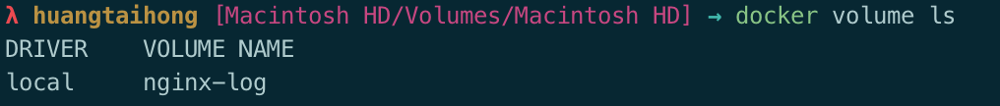
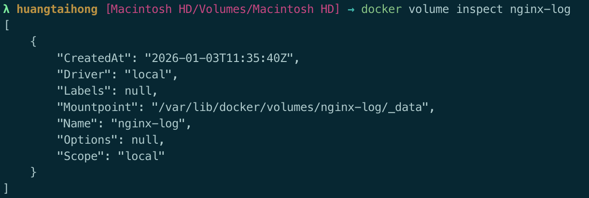

默认情况下，在运行的容器里创建的文件，被保存在一个可写的容器层:

- 如果容器被删除了，则数据也没有了
- 这个可写的容器层是和特定的容器绑定的，也就是这些数据无法方便的和其他容器共享

Docker主要提供了两种方式做数据的持久化

- Data Volume，卷挂载: 由Docker管理
- Bind Mount，绑定挂载: 由用户指定主机上的文件/目录挂载到容器中


# Data Volume

格式:

```
docker run -v [<volume-name>:]<mount-path>[:opts]
```

如我期望挂载Nginx的文件日志目录

```
docker run -d -v nginx-log:/var/log/nginx nginx
```

通过`docker volume ls` 查看到已经创建的卷



使用`docker volume inspect`可以查看到该卷的具体信息



如果需要在多个主机共享存储，可以参考:

https://docs.docker.com/engine/storage/volumes/#use-a-volume-driver


# Bind mounts

格式:

```
docker run -v <host-path>:<container-path>[:opts]
```

如我期望把`/Users/huangtaihong/workspace/nginx`挂载到容器内

```
docker run -d -v /Users/huangtaihong/workspace/nginx:/var/log/nginx nginx
```


