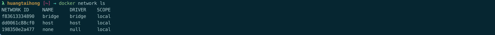
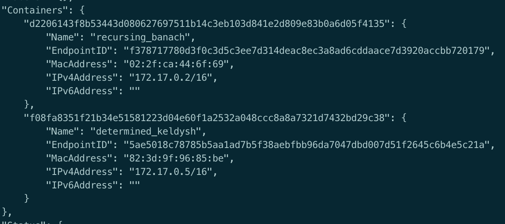

容器网络是指容器相互连接和通信，以及与非Docker服务连接和通信的能力

# Bridge网络

默认情况下Docker提供三种网络



如果创建容器时不指定任何参数，那么容器将绑定到默认的`bridge`网络中

通过命令`docker network inspect f83613334890`可以查看绑定到该网桥的信息



如果两个容器绑定到一个网桥上，那他们就可以通信了


使用`docker create`或`docker run`创建或运行容器时，桥接网络上所有容器的端口都可以从Docker主机和连接到同一网络的其他容器访问。但是这些端口无法从主机外部访问，在默认配置下也无法从其他网络中的容器访问

使用端口映射`-p`使端口在主机外部可用，并可提供其他桥接网络中的容器，示例

```
docker container run -d  -p 80:80 nginx
```


# Host网络

使用场景: 为了网络的性能优化


如果容器使用`host`网络模式，则该容器的网络不会和Docker宿主机隔离(共享主机的网络命名空间)

并且容器不会分配自己的IP地址

例如: 如果你运行一个绑定到80端口的容器，并且使用`host`网络模式，则容器将无法获取自己的IP地址

在网络连接方面，容器的应用程序可通过主机IP地址的80端口范围。以Nginx为例

```
docker run --net=host -d nginx
```

使用`host`模式下的网络配置，容器在使用时没有自己的IP地址。所以端口映射将不起作用。如`-p` 、`-P`等端口映射参数将被忽略


# Docker网络互通原理推荐学习


